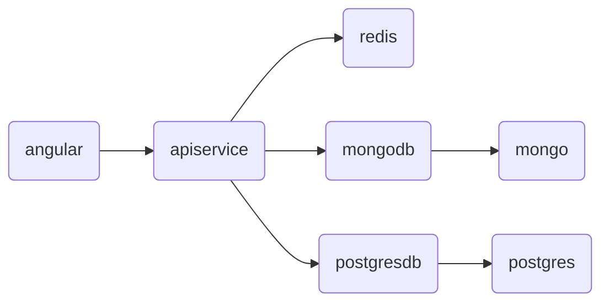

# AspireTodoApp

## Technologies used  
- .NET Aspire (+ Docker)
- ASP.NET Core
- EF Core
- MongoDB.Driver
- Serilog
- HotChocolate (GraphQL)
- Redis
- Scalar API docs

## Screenshots

### Angular

### Aspire resources

### Aspire traces

## Aspire resource diagram

